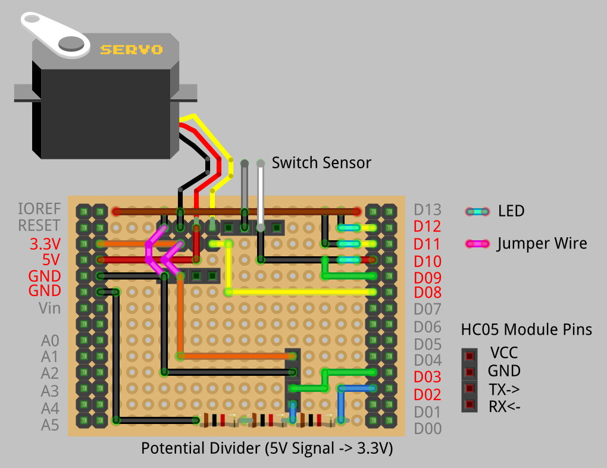
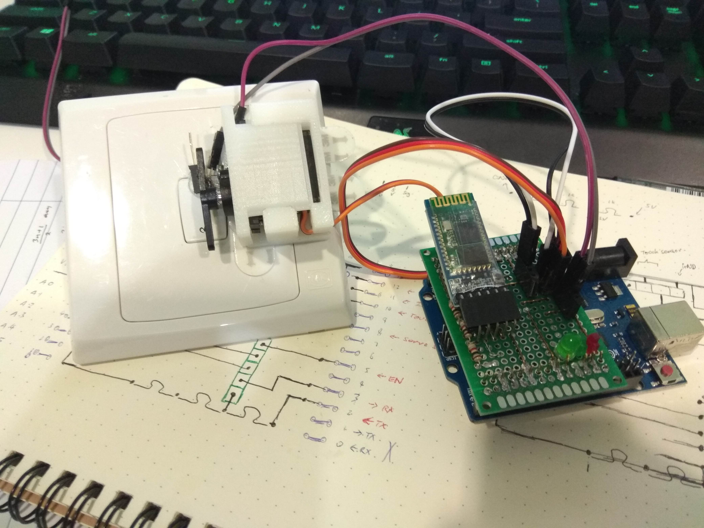

# Lumos Switch Hardware - v0.0.1 Prototype

We used a low-cost Arduino Uno micro-controller to prototype our device (mechanical IoT-enabled switch flipper) together with a HC-05 bluetooth module and a TowerPro SG90 servo.

A 3d-printed housing is used to secure the servo onto the switch surface and a custom arduino shield was soldered on a breadboard to reduce the overall profile of our setup.



**warning** It is recommended to regulate the signal voltage down to a manageble 3.3V for the HC-05 module as the RX pin on the module is not rated for the 5V signal Arduino sends by default.

## Prototype setup

Hooked up to a wall switch.


# Arduino Firmware

## Comunication with HC-05 Module (Setup into AT-Mode)

To enable AT-Mode with your HC-05 module, press and **hold** the button on the module (when it is powered off) and power it on. If the blinking is roughly once every 3s, you're good to go in AT-Mode, otherwise, the module will blink rapidly (power it off and retry).

Once in AT-Mode, load the hc05_config program which is simply a read/write channel to the module.

```
//Adjust the parameters as neccessary to your setup
SoftwareSerial BTserial(3, 2);  //RX pin | TX pin (relative to the Arduino)
```

## AT Commands (Configuration)

Out-of-the-box, the HC-05 module has a default password like 1234 (totally insecure) and a default name. You should change it!!

**important!** Open the Serial Monitor and select "Both NL & CR" at the default 9600baud before attempting communication with the module.

First, try a "AT" command, you should get a "OK" response. Next we want to rename our module into something more friendly:

```
AT+NAME="LUMOS"
```

Now if you try a "AT+NAME?" command, you should get "+NAME: LUMOS" response (or sth similar).

Next we want to setup our password.

```
AT+PSWD="1234"
```

Obviously you should change it to something more secure. In any case, you can use "AT+PSWD?" to view the set password if you forget.

Power off the module and power it back on to escape AT-mode. Now we're ready to pair with our backend/bluetooth controller!

Here's a [full list of AT commands](http://www.linotux.ch/arduino/HC-0305_serial_module_AT_commamd_set_201104_revised.pdf).

### Android Controller

You can use the [Bluetooth Terminal](https://play.google.com/store/apps/details?id=project.bluetoothterminal&hl=en) app on play store to quickly pair with your HC-05 module and test it out. If you still have your serial monitor up, you should be able to see the messages your phone is sending to the HC-05 module :D

## Configured Commands

Particular bluetooth commands are hard-coded into the firmware as triggers to move the servo. A 'contact sensor' (two pieces of conductive metal touching) is used to give feedback to the current switch position.

```
U -> 'Up' Movement of servo
D -> 'Down' Movement of servo
T -> Flicker lights in a certain order to signal device connection
Closed circuit  -> C //Switch sensor detects one position
Open circuit    -> O //Switch sensor detects the other position
```

# Files

[**blue_shield**](blue_shield) -> Arduino firmware driving the switch

[**hc05_config**](hc05_config) -> Code to allow Arduino serial terminal to configure hc-05 bluetooth module

[**servo_housing.stl**](servo_housing.stl) -> Stl file to 3d-print servo housing
